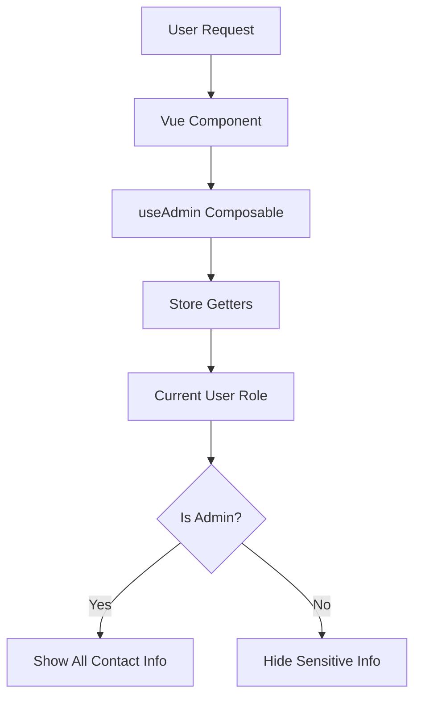

# Design Document

## Overview

This design implements role-based privacy controls for sensitive contact information in Chatwoot's frontend. The solution leverages the existing `useAdmin()` composable to conditionally render sensitive contact data based on user roles. The implementation is purely frontend-based, requiring no backend API changes, and maintains consistency across all contact-related interfaces.

## Architecture

### Component-Level Privacy Control
The privacy controls are implemented at the Vue component level using conditional rendering (`v-if` directives) based on the `isAdmin` computed property from the `useAdmin()` composable.



### Affected Components
The following components require modification to implement privacy controls:

1. **ContactInfo.vue** - Main contact information display in conversation sidebar
2. **ContactsCard.vue** - Contact cards in contact management views
3. **SearchResultContactItem.vue** - Contact information in search results
4. **SearchResultConversationItem.vue** - Contact info in conversation search results
5. **ContactMergeForm.vue** - Contact information in merge dialogs
6. **contactFilterItems/index.js** - Filter options for contact searches

## Components and Interfaces

### Core Privacy Control Pattern

Each component follows this pattern:

```vue
<script setup>
import { useAdmin } from 'dashboard/composables/useAdmin';

const { isAdmin } = useAdmin();
</script>

<template>
  <!-- Sensitive information with conditional rendering -->
  <div v-if="isAdmin" class="sensitive-info">
    {{ contact.email }}
  </div>
  
  <!-- Non-sensitive information always visible -->
  <div class="public-info">
    {{ contact.name }}
  </div>
</template>
```

### Sensitive Data Classification

**Hidden for Non-Admins:**
- Email addresses (`contact.email`)
- Phone numbers (`contact.phone_number`)
- Custom identifiers (`contact.identifier`)
- Voice call buttons and communication actions
- Email-related filter options in search

**Always Visible:**
- Contact name
- Company name
- Location information
- Social media profiles
- Description/notes
- Avatar and status

### Component-Specific Implementations

#### ContactInfo.vue
- Wraps email, phone, and identifier `ContactInfoRow` components with `v-if="isAdmin"`
- Conditionally renders `VoiceCallButton` based on admin status
- Maintains existing component structure and styling

#### ContactsCard.vue
- Adds `useAdmin` composable to setup function
- Conditionally renders email and phone number display sections
- Preserves card layout and responsive design

#### Search Components
- Modifies computed properties to filter out sensitive information
- Updates display logic to hide email/phone in search results
- Maintains search functionality for non-sensitive data

#### Filter Components
- Creates filtered versions of filter options
- Removes email and phone-based filters for non-admin users
- Preserves all other filtering capabilities

## Data Models

### User Role Model
The existing user role system is leveraged without modification:

```javascript
// Current user role from store
currentUserRole: 'administrator' | 'agent' | 'custom_role'

// Admin check
isAdmin: computed(() => currentUserRole === 'administrator')
```

### Contact Data Model
No changes to the contact data model are required. The privacy controls operate on the presentation layer only:

```javascript
// Contact object structure remains unchanged
contact: {
  id: Number,
  name: String,
  email: String,        // Hidden for non-admins
  phone_number: String, // Hidden for non-admins
  identifier: String,   // Hidden for non-admins
  // ... other properties remain visible
}
```

## Error Handling

### Graceful Degradation
- If `useAdmin()` composable fails, default to non-admin view (safer approach)
- Maintain component functionality even if role detection fails
- Log errors without exposing sensitive information

### Role Change Handling
- Vue's reactivity system automatically updates visibility when user role changes
- No manual refresh or re-rendering required
- Immediate response to role updates

### Fallback Behavior
```javascript
// Safe fallback implementation
const { isAdmin } = useAdmin() || { isAdmin: ref(false) };
```

## Testing Strategy

### Unit Testing
- Test each component's conditional rendering based on admin status
- Verify sensitive information is hidden for non-admin users
- Confirm all information is visible for admin users
- Test edge cases and error conditions

### Integration Testing
- Test role changes and immediate UI updates
- Verify consistency across all contact-related interfaces
- Test search and filter functionality with privacy controls

### Test Cases
1. **Admin User Tests**
   - All contact information visible
   - All action buttons available
   - All filter options accessible

2. **Non-Admin User Tests**
   - Sensitive information hidden
   - Communication actions restricted
   - Filtered search options

3. **Role Change Tests**
   - Immediate UI updates on role change
   - No cached sensitive data exposure
   - Proper re-rendering of components

### Component Testing Pattern
```javascript
// Example test structure
describe('ContactInfo Privacy Controls', () => {
  it('shows sensitive info for admin users', () => {
    // Mock admin role
    // Render component
    // Assert sensitive fields are visible
  });
  
  it('hides sensitive info for non-admin users', () => {
    // Mock non-admin role
    // Render component
    // Assert sensitive fields are hidden
  });
});
```

## Implementation Considerations

### Performance Impact
- Minimal performance impact as privacy checks are computed properties
- Vue's reactivity system efficiently handles conditional rendering
- No additional API calls or data fetching required

### Maintainability
- Centralized role logic in `useAdmin()` composable
- Consistent pattern across all components
- Easy to extend for additional privacy controls

### Security Notes
- Frontend-only implementation provides UI privacy, not data security
- Sensitive data is still transmitted to the client
- Consider backend API restrictions for enhanced security in future iterations